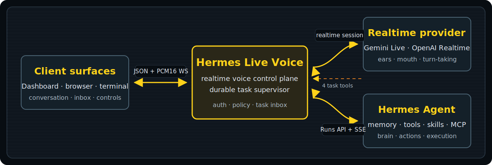

<p align="center">
  
</p>

<h1 align="center">Hermes Live Voice</h1>

<p align="center">
  <strong>Keep talking. Hermes keeps working.</strong><br>
  The realtime voice control plane and self-hosted JARVIS layer for <a href="https://github.com/NousResearch/hermes-agent">Hermes Agent</a>.
</p>

<p align="center">
  Talk naturally. Interrupt at any time. Delegate work in the background.<br>
  Disconnect, come back, and hear what finished.
</p>

<p align="center">
  <a href="#60-second-quick-start">Quick start</a>
  · <a href="#where-it-fits">Where it fits</a>
  · <a href="docs/plugin.md">Dashboard plugin</a>
  · <a href="docs/ui-integration.md">Browser SDK</a>
  · <a href="docs/client-protocol.md">Protocol v3</a>
  · <a href="docs/security.md">Security</a>
</p>

<p align="center">
  <a href="https://github.com/bielcarpi/hermes-live-voice/actions/workflows/ci.yml"></a>
  <a href="https://www.npmjs.com/package/hermes-live-voice"></a>
  <a href="https://github.com/bielcarpi/hermes-live-voice/releases"></a>
  <a href="LICENSE"></a>
  
  
</p>

## Voice that does not block the work

Hermes Agent already has first-party push-to-talk STT/TTS voice. Hermes Live Voice solves a different problem: it keeps a natural, interruptible realtime conversation responsive while independently supervised Hermes tasks continue behind it.

Ask Hermes to inspect a repository, research three options, or run a release check. The voice model gets an immediate durable task receipt, so you can keep talking, delegate more safe work, or leave. The gateway owns the task lifecycle, reconciles it with Hermes Agent, and keeps an unread completion inbox for your return.

- **Realtime conversation:** Gemini Live or OpenAI Realtime handles speech, turn-taking, and interruption.
- **Durable delegation:** accepted tasks survive client disconnects and gateway restarts when state is preserved and Hermes still knows the upstream run.
- **Safe parallelism:** mutating work runs exclusively; explicitly read-only tasks overlap only across disjoint resource keys.
- **Completion reporting:** connected sessions receive a bounded notice; reconnecting clients restore active tasks and unread results.
- **One control plane:** Hermes Dashboard, the browser SDK/demo, and the terminal see the same protocol v3 task state.
- **A narrow trust boundary:** providers can use four task-control tools, never arbitrary Hermes tools directly, credentials, or approvals.

This is the JARVIS-like interaction people mean—talking to one calm interface while specialist work continues around it—not a claim of fictional autonomy. Hermes still operates with the tools, permissions, and policies you configured.

> Try: “Audit the API and documentation as separate read-only tasks. Keep talking to me about the launch, and tell me when each one finishes.”

## 60-second quick start

You need Node.js 20+, a running [Hermes Agent API Server](https://github.com/NousResearch/hermes-agent/blob/main/website/docs/user-guide/features/api-server.md), and its `API_SERVER_KEY`. No speech-provider key is needed for the first mock-mode test.

If the API Server is not enabled yet, add `API_SERVER_ENABLED=true` and a strong `API_SERVER_KEY` to `~/.hermes/.env`, then keep `hermes gateway run` running in another terminal.

### 1. Install the beta and its Dashboard plugin

```sh
npm install --global hermes-live-voice@next
hermes-live plugin install --force
hermes plugins enable hermes-live
```

### 2. Start Hermes Live against your local Hermes API

Use the same secret that Hermes has in `~/.hermes/.env` as `API_SERVER_KEY`:

```sh
HERMES_AGENT_API_SERVER_KEY=your-hermes-api-server-key \
HERMES_LIVE_PROVIDER=mock \
hermes-live serve
```

### 3. Open a client

```sh
hermes dashboard
```

Open **Live Voice** and type: *“Inspect this repository and tell me whether it is ready to release.”* Mock mode exercises the Dashboard proxy, protocol, durable supervisor, and real Hermes run bridge without using microphone, speaker, or provider credits.

You can also open the bundled browser demo at <http://127.0.0.1:8788>, or start the text-control terminal:

```sh
hermes-live terminal
```

### 4. Turn on speech

```sh
# Gemini Live
HERMES_AGENT_API_SERVER_KEY=your-hermes-api-server-key \
GEMINI_API_KEY=your-gemini-key \
HERMES_LIVE_PROVIDER=gemini \
hermes-live serve

# OpenAI Realtime
HERMES_AGENT_API_SERVER_KEY=your-hermes-api-server-key \
OPENAI_API_KEY=your-openai-key \
HERMES_LIVE_PROVIDER=openai \
hermes-live serve
```

Run `hermes-live provider-smoke` with the same environment before a real deployment. That verifies the provider handshake; complete [live audio testing](docs/live-provider-testing.md) separately.

## Where it fits

| You want | Use |
| --- | --- |
| First-party local push-to-talk | [Hermes Voice Mode](https://github.com/NousResearch/hermes-agent/blob/main/website/docs/user-guide/features/voice-mode.md) |
| Daily hands-free supervision | **Hermes Dashboard + Live Voice** |
| A custom or community web UI | **`hermes-live-voice/browser`** behind an authenticated relay |
| Gateway development or troubleshooting | **Bundled browser demo** |
| SSH, accessibility, or headless control | **`hermes-live terminal`** |

The terminal is intentionally text-only. It shows transcripts, task state, and notifications; `/tasks`, `/status <taskId>`, `/result <taskId>`, `/ack <taskId>` (or `/read`), and `/stop <taskId>` address durable work, while `/interrupt` stops only current provider speech. `/quit` detaches without cancelling tasks.

The Dashboard tab is supplied by this community plugin, not bundled with Hermes Agent. Generic OpenAI-compatible chat UIs need an adapter because realtime audio and protocol v3 task events are not ordinary chat-completions traffic. See [UI integration](docs/ui-integration.md).

## Four tools, one durable inbox

The realtime provider can call only:

- `start_background_task` — persist and enqueue meaningful Hermes work; return a stable `taskId` immediately.
- `list_background_tasks` — list active and recent tasks owned by this Hermes user scope.
- `get_background_task` — retrieve the exact state or bounded retained result for one `taskId`.
- `stop_background_task` — cooperatively cancel one exact `taskId`.

Stopping provider playback does not cancel background work. Stopping one task does not guess at, widen to, or cancel its neighbors.

## How it works



1. A Dashboard, browser, or terminal client opens the authenticated JSON/PCM16 WebSocket.
2. The gateway maintains the realtime conversation and exposes the four bounded task tools.
3. `start_background_task` is persisted before its receipt is published; the server supervisor then admits it under the concurrency policy.
4. Each task maps to one Hermes Agent `/v1/runs` run, observed through SSE plus periodic status reconciliation.
5. Terminal state becomes a durable notification. Connected clients are told when idle; disconnected clients receive the inbox on reconnect.

Task state defaults to `~/.hermes/hermes-live/tasks-v1.json`. Its directory and file are created private, and Docker deployments mount a dedicated state volume. Read the [architecture](docs/architecture.md), [protocol](docs/client-protocol.md), and [security model](docs/security.md) before exposing the gateway beyond localhost.

## Build a custom client

```sh
npm install hermes-live-voice@next
```

```js
import { HermesLiveClient } from "hermes-live-voice/browser";

const client = new HermesLiveClient({
  webSocketUrlProvider: () => getAuthenticatedSameOriginUrl(),
});

client.on("task.completed", ({ taskId, result }) => {
  showCompletion(taskId, result.summary);
});

await client.connect();
client.sendText("Audit the repository while I plan the launch.");
```

The dependency-free client also provides microphone capture, bounded playback, reconnect reconciliation, task listing/get/stop, notification acknowledgement, and strict protocol validation. Never embed an installation-wide gateway token in public browser code; use a same-origin authenticated proxy or short-lived ticket.

## Honest beta boundaries

v0.5.0-beta.1 is for self-hosted, trusted-client evaluation. Its durability has a deliberate scope:

- Closing a browser, terminal, or voice session does **not** cancel accepted tasks.
- Restarting Hermes Live preserves task records and can resume reconciliation if the same Hermes Agent process still knows the upstream run.
- Restarting Hermes Agent loses its in-memory `/v1/runs` state. Hermes Live marks an unprovable outcome `unknown`; it does not invent success or retry side effects.
- If a run-creation response is ambiguous, the task becomes `dispatch_unknown` and unsafe new work is fenced. The gateway never automatically repeats a possibly accepted mutation.
- Realtime audio sessions themselves are not durable, and the local state file is not a multi-node distributed queue.
- Current Hermes Agent releases do not provide identity strong enough for safe targeted approval responses. v0.5 has no approval UI: it denies pending approvals and stops that task fail-closed.

Provider notifications are best-effort while a live speech session exists; the durable client inbox is the source of truth. Task results are treated as untrusted content, bounded before projection, and disclosed to the selected speech provider only when needed for the conversation.

## What has been exercised

The v0.5 release candidate has completed real end-to-end checks against the official Hermes Agent v0.18.2 Docker image: run creation, SSE progress, exact cancellation, serialized exclusive work, client detachment/reconnect, retained output, and completion notification. Tagged publication additionally requires the deterministic protocol, supervisor, storage, browser SDK, Dashboard/plugin, terminal, gateway, package, security, and Docker gates to pass.

Those checks do not prove every microphone/speaker, provider account, network, long session, or Hermes tool policy. Treat beta as evidence-backed software, not a promise that an agent can safely perform arbitrary work. Follow the [real-provider checklist](docs/live-provider-testing.md) for your environment.

## Deployment and security

The gateway reads process environment and does not automatically load `.env`. [.env.example](.env.example) documents the task limits, provider settings, state path, auth, origin allowlist, and identity policy. [examples/docker-compose.yml](examples/docker-compose.yml) runs non-root, read-only, capability-free, and with persistent task state.

A network-accessible bind requires a strong `HERMES_LIVE_AUTH_TOKEN`; put it behind TLS, set an exact `HERMES_LIVE_ALLOW_ORIGIN`, keep Hermes/provider endpoints private, and add edge rate/cost limits. This is not turnkey public multi-tenancy. Review [docs/security.md](docs/security.md) and report vulnerabilities privately through [SECURITY.md](SECURITY.md).

Useful commands:

```sh
hermes-live serve             # gateway + browser demo
hermes-live terminal          # persistent text control and task inbox
hermes-live client "..."      # one task, wait for its exact result
hermes-live check             # gateway/Hermes/provider diagnostics
hermes-live provider-smoke    # live provider connect/close proof
hermes-live plugin status     # inspect the Dashboard plugin install
```

## Contributing

Focused contributions are welcome: reconnect fixtures, accessible clients, provider event coverage, safe progress narration, deployment evidence, and adapters for community UIs.

Start with [CONTRIBUTING.md](CONTRIBUTING.md), include tests with behavior changes, and keep security-sensitive provider or task-control changes narrowly scoped. Use [GitHub Discussions](https://github.com/bielcarpi/hermes-live-voice/discussions) for designs and [SUPPORT.md](SUPPORT.md) for setup help.

[Contribution guide](CONTRIBUTING.md) · [Issue templates](https://github.com/bielcarpi/hermes-live-voice/issues/new/choose) · [Security policy](SECURITY.md) · [Code of Conduct](CODE_OF_CONDUCT.md)

## License and names

[MIT](LICENSE). Hermes Live Voice is community-maintained and is not an official NousResearch distribution. “JARVIS-like” describes the interaction pattern; this project is not affiliated with or endorsed by Marvel. Hermes Agent, Gemini, OpenAI, and other names belong to their respective owners and are governed by their own terms.

---

<p align="center">
  <strong>Keep talking. Hermes keeps working.</strong>
</p>
