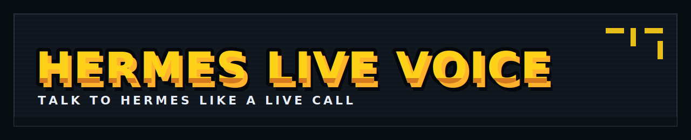
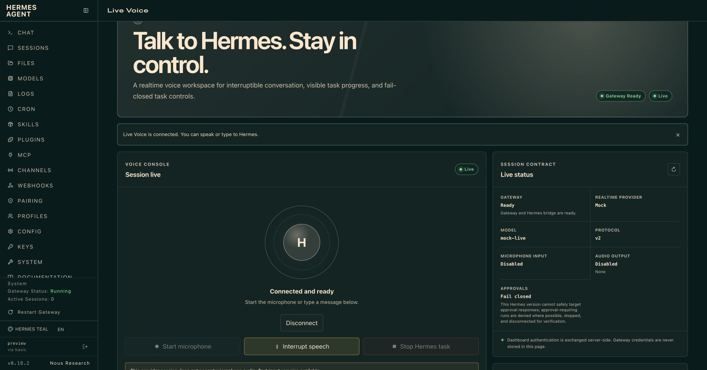
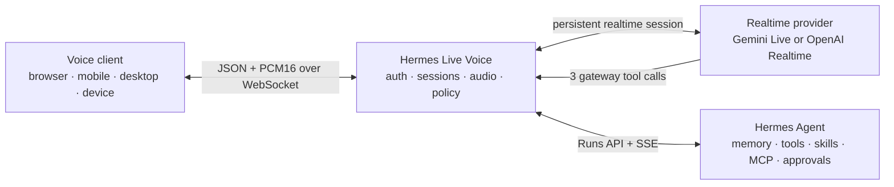

<p align="center">
  
</p>

<h1 align="center">Hermes Live Voice</h1>

<p align="center">
  <strong>Talk to Hermes like a live call.</strong>
</p>

<p align="center">
  The open-source realtime voice layer for <a href="https://github.com/NousResearch/hermes-agent">Hermes Agent</a>.<br>
  Gemini Live or OpenAI Realtime handles natural conversation and interruption;<br>
  Hermes keeps the memory, tools, skills, approvals, and work.
</p>

<p align="center">
  <a href="#quick-start">Quick start</a>
  · <a href="#why-not-just-use-hermes-voice-mode">Why this exists</a>
  · <a href="docs/plugin.md">Plugin</a>
  · <a href="docs/ui-integration.md">UI integration</a>
  · <a href="docs/client-protocol.md">Client protocol</a>
  · <a href="docs/architecture.md">Architecture</a>
  · <a href="docs/roadmap.md">Roadmap</a>
</p>

<p align="center">
  
</p>

<p align="center">
  <a href="https://github.com/bielcarpi/hermes-live-voice/actions/workflows/ci.yml"></a>
  <a href="https://github.com/bielcarpi/hermes-live-voice/releases"></a>
  <a href="LICENSE"></a>
  
  
</p>

## Give Your Hermes Agent A Realtime Voice

Hermes Live Voice is a Hermes plugin, a self-hosted voice gateway, and a small client protocol. It turns an existing Hermes Agent into the action-taking brain behind an interruptible speech-to-speech conversation.

Ask it to inspect a repository, use memory, research something current, or run a command. The realtime model handles the speech loop; Hermes performs the tool-using work, while clients keep progress and stop controls visible. Targeted approval controls appear only when the connected Hermes version can correlate each decision safely.

```txt
You speak
   ↓
Gemini Live or OpenAI Realtime
   ↓  delegates meaningful work
Hermes Live Voice gateway
   ↓
Hermes Agent — memory, tools, skills, MCP, approvals
   ↓
The result returns to the live conversation
```

In v0.3, delegation to Hermes is synchronous from the realtime provider's perspective: conversation is fluid before and after the delegated run, but the speech model waits for that run's terminal result. The Dashboard and other clients still receive live task events and stop controls during the wait, plus targeted approvals when Hermes advertises stable approval IDs. Continuous provider-side conversation while Hermes works is a roadmap item, not a current claim.

The realtime provider receives three narrow gateway tools—not unrestricted access to the Hermes toolbelt. Provider credentials, Hermes credentials, Hermes session keys, and approval decisions remain outside the provider.

### What you get

- **Natural realtime conversation** — persistent speech sessions instead of record, transcribe, wait, and synthesize loops.
- **Barge-in and cancellation** — interrupt provider speech and stop an active Hermes run.
- **The Hermes you already configured** — keep its memory, terminal access, skills, MCP servers, approval policy, and model setup.
- **Two live providers** — Gemini Live and OpenAI Realtime, plus a deterministic mock provider for local development.
- **A client-ready gateway** — connect a browser, mobile app, desktop app, embedded device, or terminal client over WebSocket.
- **Fail-closed approval compatibility** — enable human decisions only when Hermes advertises stable approval IDs; otherwise deny where possible, stop the run, and close the session instead of guessing.
- **A first-class Hermes Dashboard integration** — install a **Live Voice** tab with transcript, task progress, interruption, run stop, and negotiated approval status.
- **A real Hermes plugin** — install `hermes-live`, check gateway status from Hermes, and keep voice integration discoverable.

> **Approval compatibility:** Hermes Agent's current Runs API, verified against the official v0.18.2 image and upstream `main` for this release, does not yet identify approval requests strongly enough to target concurrent decisions safely. Hermes Live Voice therefore attempts a deny-all, stops that run, and closes the voice session with an explicit verification warning. It never lets an uncorrelated approval run continue. Interactive controls enable automatically only when Hermes advertises `features.run_approval_response_by_id: true` and echoes the same approval identity in its response.

## See The Difference

The useful demo is not a chatbot greeting. It is a live request that makes Hermes work:

> “Inspect this repository, run the tests, and tell me whether it is safe to release.”

A good client can acknowledge immediately, let the user interrupt, show Hermes run progress, cancel when asked, and speak the final result. With a targeted-approval-capable Hermes release, it can also surface and correlate explicit human decisions.

## Why Not Just Use Hermes Voice Mode?

Hermes includes an excellent built-in [Voice Mode](https://hermes-agent.nousresearch.com/docs/user-guide/features/voice-mode/) for speaking directly with the Hermes CLI. Start there when you want the shortest local path.

Use Hermes Live Voice when the product itself needs a persistent realtime conversation or a custom client:

| | Hermes Voice Mode | Hermes Live Voice |
| --- | --- | --- |
| Best for | Speaking with the Hermes CLI | Building browser, mobile, desktop, or device voice clients |
| Voice architecture | Hermes-managed speech pipeline | Persistent provider speech-to-speech session |
| Interruption | CLI voice interaction | Client-controlled barge-in, playback truncation, and run stop |
| Client protocol | Built into Hermes | Public JSON/WebSocket protocol |
| Providers | Hermes voice configuration | Gemini Live, OpenAI Realtime, or mock |
| Agent actions | Hermes | Hermes, through three gateway tools |
| Deployment shape | Local Hermes feature | Separate self-hosted gateway and optional Hermes plugin |

This project does not replace Hermes Voice Mode. It serves the integration layer that Voice Mode is not designed to be.

## Choose How You Use It

| Surface | Best for | Audio |
| --- | --- | --- |
| **Hermes Dashboard + Live Voice plugin — recommended** | Daily use with transcript, task progress, interruption, stop, and negotiated approval status | Browser microphone and playback |
| **Bundled browser demo** | Local development and gateway troubleshooting | Browser microphone and playback |
| **`hermes-live-voice/browser`** | Community web UIs and custom React, Vue, Svelte, vanilla, or Electron clients | Host-integrated microphone and playback |
| **`hermes-live terminal`** | SSH, headless systems, automation, and remote text control | Text only |
| **Hermes Ctrl+B Voice Mode** | The fastest local terminal voice experience | Hermes-managed voice |

Generic chat UI compatibility is not the same as Hermes Live compatibility. A community UI needs the browser client or JSON/WebSocket protocol, microphone and playback controls, and a secure server-side authentication bridge. OpenAI-compatible chat support alone does not provide persistent realtime audio, barge-in, run events, or the negotiated approval lifecycle. See [UI integration](docs/ui-integration.md) for the exact contract.

## Quick Start

### Prerequisites

- Node.js 20 or newer.
- A running [Hermes Agent API Server](https://hermes-agent.nousresearch.com/docs/user-guide/features/api-server/) with its `API_SERVER_KEY` configured.
- A Gemini or OpenAI key for real speech. No provider key is needed for mock mode.

### 1. Install and build

Until the first npm publication, install from GitHub:

```sh
git clone --branch v0.3.1 --depth 1 https://github.com/bielcarpi/hermes-live-voice.git
cd hermes-live-voice
npm ci
npm run build
```

### 2. Install the Hermes plugin

Current Hermes releases can install and enable the plugin directly from this repository:

```sh
hermes plugins install bielcarpi/hermes-live-voice/plugins/hermes-live --enable
```

If you already cloned and built the gateway, the package installer provides the same plugin locally:

```sh
node dist/cli.js plugin install
hermes plugins enable hermes-live
```

The repository/package name is `hermes-live-voice`. The short CLI command and Hermes plugin id are `hermes-live`.

### 3. Start safely in mock mode

Use the same value for `HERMES_AGENT_API_SERVER_KEY` that Hermes uses for `API_SERVER_KEY`:

```sh
HERMES_BASE_URL=http://127.0.0.1:8642 \
HERMES_AGENT_API_SERVER_KEY=your-hermes-api-server-key \
HERMES_LIVE_PROVIDER=mock \
npm run dev
```

Start or restart Hermes Dashboard after enabling the plugin:

```sh
hermes dashboard
```

Open **Live Voice**, connect, and send a text message. Mock mode verifies the Dashboard proxy, gateway, client protocol, and Hermes run bridge without spending realtime-provider credits. It intentionally disables microphone input and audio output.

The standalone development UI remains available at <http://127.0.0.1:8788>. Use it when developing the gateway or debugging an installation without the Dashboard.

### 4. Turn on live speech

Gemini Live:

```sh
HERMES_LIVE_PROVIDER=gemini \
GEMINI_API_KEY=your-gemini-key \
HERMES_AGENT_API_SERVER_KEY=your-hermes-api-server-key \
npm run dev
```

OpenAI Realtime:

```sh
HERMES_LIVE_PROVIDER=openai \
OPENAI_API_KEY=your-openai-key \
OPENAI_REALTIME_MODEL=gpt-realtime-2.1 \
HERMES_AGENT_API_SERVER_KEY=your-hermes-api-server-key \
npm run dev
```

Before calling a real-provider deployment ready, open an actual provider session:

```sh
npm run check:live-provider
```

Then complete the audio, interruption, approval, and negative-case checklist in [docs/live-provider-testing.md](docs/live-provider-testing.md).

## Use It From A Terminal

Hermes already has the right local microphone experience: run `hermes` and press **Ctrl+B** for official Hermes Voice Mode. Hermes Live Voice does not duplicate that audio stack or add native microphone dependencies.

For a remote gateway, automation host, or headless machine, open the persistent text-control console:

```sh
HERMES_LIVE_URL=https://voice.example.com \
HERMES_LIVE_AUTH_TOKEN=your-gateway-token \
node dist/cli.js terminal
```

The console keeps one realtime session open, shows provider transcripts, Hermes task progress, and negotiated approval warnings or requests, and provides separate `/interrupt` (request provider-response cancellation) and `/stop` (stop Hermes work) controls. Provider cancellation is best effort; Gemini accepts the request without a dedicated upstream cancellation acknowledgement. Use `/help` for the full command list. It intentionally does not capture or play audio; use the Hermes Dashboard or browser UI for remote gateway audio.

For scripts and CI, the existing one-shot command remains available:

```sh
node dist/cli.js client "What is the current status?"
```

## Supported Providers

| Provider | Default model | Notes |
| --- | --- | --- |
| Gemini Live | `gemini-3.1-flash-live-preview` | Uses the Google Gen AI SDK. Vertex/Enterprise configuration is supported. |
| OpenAI Realtime | `gpt-realtime-2.1` | Server-side WebSocket integration with speech, tool calls, VAD or push-to-talk, and reasoning effort. |
| Mock | `mock-live` | Text-only local development and deterministic CI. |

Model ids are configuration, not hardcoded provider forks. Override `GEMINI_MODEL` or `OPENAI_REALTIME_MODEL` when validating a compatible model.

### About future `gpt-live-1` support

`gpt-live-1` is not currently listed in OpenAI's public API documentation or model catalog. It cannot be selected or truthfully advertised as supported today.

The project is designed to adopt new OpenAI live models without changing the Hermes boundary. If `gpt-live-1` becomes a public Realtime-compatible API model, the plan is to add captured event fixtures, tool-call coverage, interruption tests, and a real provider handshake before listing it as supported. See the [compatibility roadmap](docs/roadmap.md#provider-roadmap).

Current OpenAI model guidance is tracked against the official [Realtime and audio documentation](https://developers.openai.com/api/docs/guides/realtime), not rumors or private product labels.

## How It Works



The realtime model is the **ears, mouth, and turn-taking layer**. Hermes is the **brain and action layer**. The gateway is the **translator and security boundary**.

The provider can ask the gateway to:

- `start_hermes_run`
- `get_hermes_run_status`
- `stop_hermes_run`

It cannot call arbitrary Hermes tools or submit approvals. When Hermes supports targeted approval responses, choices come only from a connected human client and are validated against the exact correlated envelope. A legacy uncorrelated request is never offered as a human choice: the gateway attempts denial, stops the run, and closes the voice session for operator verification.

Read the [architecture](docs/architecture.md) and [client protocol](docs/client-protocol.md) for the full lifecycle.

## Configuration

Copy the example and change only what you need:

```sh
cp .env.example .env
```

### Hermes

```sh
HERMES_BASE_URL=http://127.0.0.1:8642
HERMES_AGENT_API_SERVER_KEY=...
```

`HERMES_AGENT_API_SERVER_KEY` must equal Hermes Agent's `API_SERVER_KEY`. The older `HERMES_API_KEY` name remains a compatibility alias.

### Public or LAN gateway

```sh
HERMES_LIVE_HOST=0.0.0.0
HERMES_LIVE_AUTH_TOKEN=$(openssl rand -hex 32)
HERMES_LIVE_ALLOW_ORIGIN=https://voice.example.com
HERMES_LIVE_DEMO_ENABLED=false
```

The gateway refuses a network-accessible bind without a strong auth token unless you explicitly set the unsafe `HERMES_LIVE_ALLOW_UNAUTHENTICATED=true` opt-out.

This release is intended for a self-hosted, trusted-user installation. A shared bearer token is not multi-tenant identity. Do not expose the gateway as a public multi-user SaaS without adding per-user authentication, quotas, rate limits, and an identity-to-Hermes-profile policy.

### OpenAI

```sh
HERMES_LIVE_PROVIDER=openai
OPENAI_API_KEY=...
OPENAI_REALTIME_MODEL=gpt-realtime-2.1
OPENAI_REALTIME_VOICE=marin
OPENAI_REALTIME_REASONING_EFFORT=low
OPENAI_REALTIME_TURN_DETECTION=disabled
```

Use `semantic_vad` or `server_vad` for provider-managed turn detection. `disabled` gives clients an explicit push-to-talk style `audio.end` boundary.

### Gemini

```sh
HERMES_LIVE_PROVIDER=gemini
GEMINI_API_KEY=...
GEMINI_MODEL=gemini-3.1-flash-live-preview
```

Vertex/Enterprise users can set `GOOGLE_GENAI_USE_ENTERPRISE=true`, `GOOGLE_CLOUD_PROJECT`, and `GOOGLE_CLOUD_LOCATION`.

The complete configuration is documented in [.env.example](.env.example) and [docs/local-setup.md](docs/local-setup.md).

## Client Protocol

Connect to:

```txt
ws://127.0.0.1:8788/v1/live
```

Start a session:

```json
{
  "type": "session.start",
  "protocolVersion": 2,
  "profileId": "default",
  "userLabel": "alice"
}
```

Send text for a smoke test:

```json
{
  "type": "text.input",
  "text": "Inspect this repository and summarize what changed."
}
```

Or stream base64 PCM16 audio frames and end the turn with `audio.end`. The server emits provider audio/transcripts, Hermes run events, completion, typed errors, and targeted approval envelopes only when the negotiated Hermes contract supports them.

The package also exposes the dependency-free browser client used by both the Hermes Dashboard integration and the bundled demo:

```js
import { HermesLiveAudio, HermesLiveClient } from "hermes-live-voice/browser";

const client = new HermesLiveClient({
  webSocketUrlProvider: () => getAuthenticatedSameOriginWebSocketUrl(),
});
const audio = new HermesLiveAudio(client, {
  workletUrl: "/mic-worklet.js",
});

client.on("approval.request", showApproval);
client.on("run.completed", ({ output }) => showResult(output));
client.on("audio.output", (message) => void audio.play(message).catch(showError));
client.on("input.speech_started", () => audio.interrupt("provider detected user speech"));
await audio.primePlayback(); // Invoke synchronously from a click or tap handler.
await client.connect();
await audio.startMicrophone();
```

The gateway serves the canonical worklet at `/mic-worklet.js`; package consumers can also resolve the `hermes-live-voice/browser/mic-worklet.js` export into their own static assets. Call `primePlayback()` directly from a user gesture before other asynchronous work so browser autoplay policy can unlock the output context. The client validates lifecycle messages, returns request IDs, reserves playback capacity before awaiting that context, bounds microphone and playback buffering, and exposes `subscribe()`/`getSnapshot()` for React or other state-driven UIs.

`webSocketUrlProvider` lets a host return a same-origin authenticated proxy URL or a host-issued short-lived ticket. The Hermes Live gateway does not mint per-user tickets itself. Do not embed an installation-wide `HERMES_LIVE_AUTH_TOKEN` in a public web app; the Dashboard integration keeps it server-side through its authenticated plugin proxy.

See [UI integration](docs/ui-integration.md) and the [client protocol](docs/client-protocol.md) before building a client.

## Commands

```sh
npm run dev                       # run the gateway from source
npm run build                     # compile the distributable CLI/library
node dist/cli.js client "..."     # one-shot text client
node dist/cli.js terminal         # persistent text-control console
node dist/cli.js chat             # alias for terminal
node dist/cli.js check            # gateway + Hermes + provider config
node dist/cli.js provider-smoke   # real provider connect/close test
node dist/cli.js plugin install   # install the Hermes plugin
node dist/cli.js plugin status    # inspect the plugin installation
npm run verify                    # complete local release gate
```

Docker users can start from [examples/docker-compose.yml](examples/docker-compose.yml). The example binds the published port to host loopback by default and runs with a read-only filesystem, no Linux capabilities, `no-new-privileges`, a PID limit, and a bounded writable `/tmp`. Put an authenticated TLS proxy in front instead of widening the host bind directly.

## Security And Maturity

Hermes Live Voice is a **developer preview for self-hosted, trusted-client use**. The architecture keeps long-lived credentials server-side and fails closed on unsafe network binds, but it is not a turnkey public multi-tenant service.

Before exposing it beyond localhost:

- terminate TLS in front of the gateway;
- require a high-entropy `HERMES_LIVE_AUTH_TOKEN`;
- restrict `HERMES_LIVE_ALLOW_ORIGIN` to the exact client origin;
- disable the bundled demo unless it is intentionally public;
- keep Hermes and provider endpoints private;
- add edge rate limits and cost controls;
- review [docs/security.md](docs/security.md) and [SECURITY.md](SECURITY.md).

Never paste secrets into an issue. Report vulnerabilities privately according to [SECURITY.md](SECURITY.md).

## Project Status

The core bridge is implemented and covered by type checks, unit tests, built-gateway smokes, fake Hermes HTTP/SSE integration, browser-client and terminal tests, Dashboard frontend and authenticated-proxy tests, plugin checks, package installation tests, and a Docker build in CI. Release candidates are also exercised manually inside the current official Hermes Docker image through the Dashboard and terminal surfaces.

What deterministic CI does **not** prove:

- valid external provider credentials or model entitlement;
- real microphone and speaker behavior;
- provider latency or cost under load;
- public multi-user safety;
- long-duration session reliability.

That distinction is intentional. See [docs/live-provider-testing.md](docs/live-provider-testing.md) and the [roadmap](docs/roadmap.md).

## Contributing

Focused contributions are welcome—especially client SDKs, safe structured progress narration, provider event fixtures, reconnect behavior, accessibility, and real-world deployment evidence.

Please read [CONTRIBUTING.md](CONTRIBUTING.md) before opening a pull request. Keep provider changes isolated, include tests, and avoid vendoring unrelated speech frameworks or rebranding the project inside a feature PR.

## License

[MIT](LICENSE). Hermes Live Voice is community-maintained and is not an official NousResearch distribution. Hermes Agent, Gemini, and OpenAI are separate projects and services governed by their own licenses and terms.

---

<p align="center">
  <strong>Hermes already has the brain. Give it a realtime voice.</strong>
</p>
