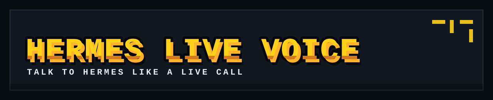
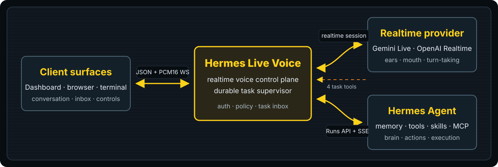

<p align="center">
  
</p>

<h1 align="center">Hermes Live Voice</h1>

<p align="center">
  <strong>Talk to Hermes while it works.</strong><br>
  Real-time voice, background work, and live progress.
</p>

<p align="center">
  <a href="https://github.com/bielcarpi/hermes-live-voice/actions/workflows/ci.yml"></a>
  <a href="https://www.npmjs.com/package/hermes-live-voice"></a>
  <a href="https://github.com/bielcarpi/hermes-live-voice/releases"></a>
  <a href="LICENSE"></a>
</p>

Hermes Live Voice is a continuous, interruptible voice layer for [Hermes Agent](https://github.com/NousResearch/hermes-agent). Open a new or saved chat and send long work to the background. Keep talking, ask what a task is doing, and hear when it finishes.

Hermes already has voice features. This project focuses on the longer workflow: the conversation stays available while separate Hermes runs work in the background. Hermes owns the agent model, tools, memory, skills, and execution. The selected voice provider handles speech. Hermes Live owns turn routing, persistent task supervision, and the client experience.

## Quick start

You need Hermes Agent 0.18.2 or newer and Node.js 20+. Releases are tested against Hermes Agent 0.20.0 (`v2026.8.3`). Local voice on Apple Silicon also needs [uv](https://docs.astral.sh/uv/).

```sh
npm install --global hermes-live-voice
hermes-live setup
hermes dashboard
```

Open **Live Voice**, choose a new or saved chat, and click **Connect**. The microphone starts automatically. Say “pause listening” or use the same screen to pause; resume from the microphone button.

On Apple Silicon, setup can install the tested [Hugging Face speech-to-speech](https://github.com/huggingface/speech-to-speech) stack. It runs local voice and the gateway as private user services. Gemini Live and OpenAI Realtime are also available.

For the normal local Hermes installation, setup also enables the private Hermes API bridge, creates its random credential, and starts `hermes gateway`. Existing remote or custom Hermes endpoints remain operator-managed.

The managed local stack needs at least 12 GB of physical memory; a 16 GB Apple Silicon Mac is recommended (roughly 8–9 GB is used while warm).

## What it does

- Continuous microphone mode with voice activity detection and barge-in
- New or resumed Hermes chats with their existing memory and history
- Background work that continues through voice disconnects
- Live, sanitized task progress and tool activity
- Parallel read-only work when the operator explicitly enables it
- Spoken completion notices and a persistent task inbox
- Dashboard, browser SDK, and headless terminal clients

Try:

> Audit this repository and run the tests in the background. While that runs, help me plan the release. Tell me when it is done.

The voice conversation stays responsive while a server-side supervisor owns the Hermes run. Interrupting speech never stops a task; stopping a task always targets its exact task ID.

## How it works



1. The Dashboard, browser SDK, or terminal opens the authenticated protocol v6 WebSocket and selects a Hermes conversation.
2. Local speech-to-speech, Gemini Live, or OpenAI Realtime handles the live voice turn and can call the gateway's small task-control toolset.
3. The gateway persists accepted work, starts a separate Hermes `/v1/runs` worker, and publishes bounded progress events.
4. Results remain in the task inbox across reconnects. Follow-ups create new workers with explicit parent/root lineage.

Task state lives at `~/.hermes/hermes-live/tasks-v1.json` by default. It is bounded, private, and single-writer.

## Clients

| Use | Client |
| --- | --- |
| Everyday voice | Hermes Dashboard → Live Voice |
| SSH or headless control | `hermes-live terminal` |
| Your own web UI | `hermes-live-voice/browser` |
| Gateway development | `hermes-live print-config` → configured local gateway |

The terminal can resume chats and inspect or control tasks:

```sh
hermes-live terminal --resume <sessionId>
```

Commands include `/tasks`, `/status`, `/result`, `/followup`, `/ack`, `/stop`, and `/interrupt`. `/quit` detaches; it does not cancel work.

Browser integration is dependency-free:

```js
import { HermesLiveClient } from "hermes-live-voice/browser";

const client = new HermesLiveClient({
  webSocketUrlProvider: () => getAuthenticatedSameOriginUrl(),
  conversation: { mode: "resume", sessionId: savedSessionId },
});

client.on("task.notification", renderNotification);
await client.connect();
```

See [UI integration](docs/ui-integration.md) for authentication and the full client lifecycle.

## Operations

```sh
hermes-live doctor --provider-smoke
hermes-live diagnostics
hermes-live service status
hermes-live service logs
hermes-live local status
hermes-live local logs
hermes-live print-config
```

After updating the npm package, run `hermes-live upgrade`. It reinstalls the matching plugin and service definitions without replacing your provider settings. `hermes-live diagnostics` writes a private support bundle without logs, prompts, task results, audio, or secret values.

`hermes-live setup` writes an allow-listed config to `$HERMES_HOME/hermes-live/config.env` (normally `~/.hermes/hermes-live/config.env`) with private permissions. The gateway and Dashboard plugin read the same file. If the default port belongs to another app, setup picks a free local port automatically. Environment variables override the managed config; project `.env` files are never loaded or executed.

For any non-loopback gateway bind, use a strong `HERMES_LIVE_AUTH_TOKEN`, an exact allowed origin, TLS, and edge rate limits. Keep Hermes itself private. See the [security model](docs/security.md).

## Current boundaries

- Durability applies to task receipts, state, notifications, and retained results. In-progress Hermes runs do not survive a Hermes Agent restart. Missing or ambiguous outcomes become `unknown`.
- Work is exclusive by default. Parallelism requires `HERMES_LIVE_TRUST_DECLARED_READ_ONLY=true` because model-declared read-only scope is policy input, not a sandbox.
- One delegated task creates one Hermes run. Hermes Live does not create a subagent team for every request.
- The local launcher is currently managed on Apple Silicon. Other systems can run the upstream realtime server and set `HERMES_LIVE_LOCAL_URL`.
- The local file store is for one gateway process, not a public multi-tenant or multi-node queue.

## Documentation

- [Setup, configuration, and Docker](docs/setup.md)
- [Background tasks and recovery](docs/background-tasks.md)
- [Architecture](docs/architecture.md)
- [Protocol v6](docs/client-protocol.md)
- [Security](docs/security.md)
- [Contributing](CONTRIBUTING.md) · [Support](SUPPORT.md)

## License

[MIT](LICENSE). This is a community project, not an official NousResearch distribution.
