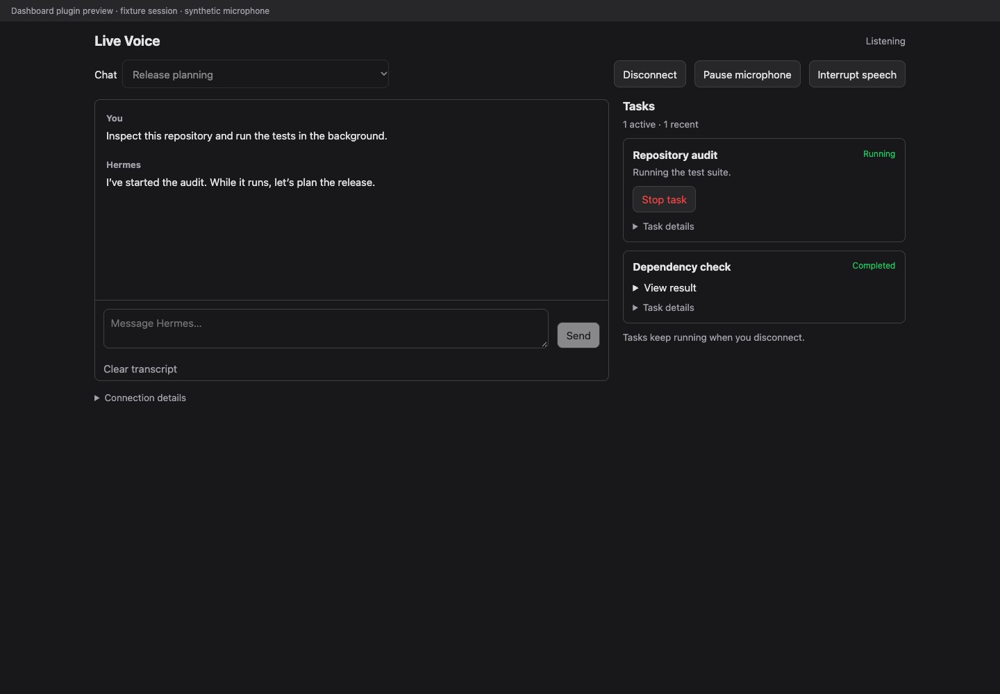

# Hermes Live Voice

Talk to [Hermes Agent](https://github.com/NousResearch/hermes-agent) while it works. Start a background task, keep talking, and find the result when you reconnect.

[](https://github.com/bielcarpi/hermes-live-voice/actions/workflows/ci.yml)
[](https://www.npmjs.com/package/hermes-live-voice)
[](https://github.com/bielcarpi/hermes-live-voice/stargazers)

## Start talking

This is the 1.3 release candidate. Install from `next`; the stable version remains available from `latest`.

You need Hermes Agent 0.18.2+, Node.js 20+ (22 or 24 recommended), and an OpenAI API key with Realtime access.

```sh
npm install --global hermes-live-voice@next
hermes-live setup
hermes dashboard
```

Setup prompts for your key, installs the Live Voice plugin, and starts the gateway. It preserves your configured provider and detects an available hosted key; otherwise it uses OpenAI. Local models are installed only when you explicitly choose local voice.

Open **Live Voice**, choose a new or saved chat, and press **Connect**. Allow microphone access and speak. Automatic turn detection is enabled by default. You can pause the microphone or interrupt a reply without stopping background work.

Try:

> Inspect this repository and run the tests in the background. While that runs, help me plan the release.

Task cards show progress and retained results. **Stop task** stops that task; disconnecting voice lets it continue.



The screenshot shows the Dashboard plugin with a fixture session; it is not evidence of live provider audio. See [provider testing](docs/live-provider-testing.md) for the verification procedure and current receipts.

## Providers

OpenAI is the default hosted path. Gemini and local Hugging Face voice are also available:

```sh
hermes-live setup --provider gemini
hermes-live setup --provider local
```

Managed local voice requires Apple Silicon, [uv](https://docs.astral.sh/uv/), and at least 12 GB memory. The first installation downloads Python and model weights. Available memory affects latency. See [setup](docs/setup.md) before choosing it.

## Troubleshooting and updates

```sh
hermes-live doctor
hermes-live launch-check
```

`doctor` prints concrete fixes. `launch-check` checks the installed plugin, gateway, provider connection, and a bounded Hermes worker separately. After it passes, test a conversation in the Dashboard to verify microphone, playback, interruption, and spoken notices.

To update:

```sh
npm install --global hermes-live-voice@next
hermes-live upgrade
```

Restart Hermes Dashboard to load the updated plugin. `upgrade` keeps your provider settings. [Setup and operations](docs/setup.md) cover services, support bundles, remote endpoints, Docker, and advanced clients.

## How it works

The Dashboard connects to a private gateway. The realtime provider handles speech and turn-taking. Hermes owns conversation history, memory, tools, and task execution. The gateway persists task receipts, progress, notifications, and results.

- Task state and results survive voice disconnects and gateway restarts. Running Hermes work cannot survive a Hermes Agent restart; ambiguous outcomes remain `unknown`.
- Work runs one task at a time by default. Declared read-only parallelism is an advanced operator option.
- Approval-required work is denied and stopped until Hermes provides safe targeted approval identity.
- This is a single-process, self-hosted integration. Network deployments require authentication, TLS, and an exact allowed origin.

[Architecture](docs/architecture.md) · [Task recovery](docs/background-tasks.md) · [Security](docs/security.md)

The [browser SDK](docs/ui-integration.md) supports host-app integrations. `hermes-live terminal` provides advanced text control over SSH. Both use the same [client protocol](docs/client-protocol.md).

## Contribute

[Report a bug](https://github.com/bielcarpi/hermes-live-voice/issues/new?template=bug_report.md), share a [provider compatibility receipt](docs/provider-compatibility-receipt-template.md), or read [contributing](CONTRIBUTING.md). The [roadmap](docs/roadmap.md) prioritizes the everyday voice workflow.

[MIT](LICENSE). This is a community integration, not an official NousResearch distribution.
